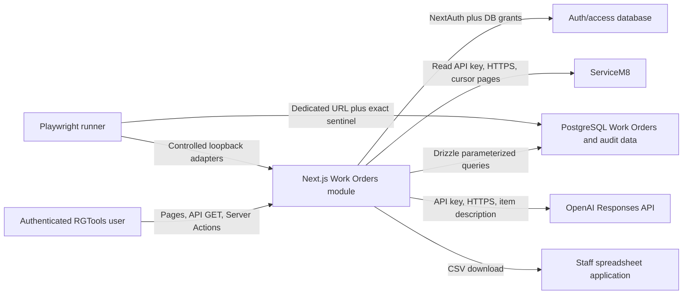

# Threat model — mt-192-workorder-changes

- Method: retrofit, reverse-engineered from current code
- Date: 2026-07-15

## Data flow and trust boundaries

Trust boundaries exist at browser/server, grant DB, ServiceM8, OpenAI, spreadsheet, and E2E DB interfaces.

## STRIDE assessment

| Threat | STRIDE | Asset / attack | Current mitigation | Residual risk |
|---|---|---|---|---|
| Direct refresh invocation | Elevation, tampering | Viewer invokes the registered implementation instead of its wrapper | `refreshWorkOrdersFromServiceM8` now calls Manage authorization before provider/DB work; direct negative test | Low; stale High retired |
| Paginated partial truth set | Tampering, DoS | Page-one-only data deactivates unseen rows | All datasets begin `cursor=-1`, follow `x-next-cursor` to absence, validate each page, detect repeated cursors before transaction | Low; stale High retired. No maximum unique-page/time boundary remains |
| Removal between item read/write | Tampering, repudiation | Refresh removes item before mutation UPDATE | Shared conditional seam requires `id` and `is_active=true`, uses `RETURNING id`, and fails before event/audit writes | Low; stale Medium retired. Real DB test exists but was not executed here |
| Automated refresh/AI calls | DoS, tampering | Repeated privileged calls consume quota/workers and overlap full refresh | Manage grant; ServiceM8 retry backoff; output validation | **Medium.** No refresh single-flight, user throttle, or request timeout |
| Removed item / forged option | Tampering | Client forges item/option IDs | Manage grant; active-write predicate; UUID parser; active option lookup | Low |
| Label repudiation | Repudiation | Mutation commits without trustworthy history | Value, item event, and global audit share one transaction and actor | Low |
| Spreadsheet formula | Injection | Export string executes on open | Formula/control-whitespace prefix neutralization plus CSV quoting | Low |
| Shared-database E2E corruption | Tampering, DoS | Acceptance reconciliation targets shared data | Exact 32+ character DB sentinel before mutation, random credentials, scoped cleanup/restoration | Low when operated correctly; browser journey not executed |
| Provider error disclosure | Information disclosure | OpenAI response body enters thrown error/log | Production action error handling may suppress client detail | **Medium/low.** Raw provider body remains in `item-labels.ts` |
| Raw snapshot retention | Information disclosure | Open-ended upstream object retained indefinitely | Authenticated access and database controls | **Medium.** No minimization or retention/deletion policy |
| Unbounded export | DoS | Authorised export materializes every job/item and CSV in memory | View grant and filter parser | **Medium/low.** No cap or streaming boundary |
| Missing refresh attribution | Repudiation | Refresh/denial cannot be tied to an actor | Refresh status/count/error rows; item mutations audited | **Medium/low.** Refresh schema has no actor; denials are not security-logged |

## Current top risks

1. Medium — refresh/OpenAI/export lack single-flight, rate, timeout, and size boundaries.
2. Medium — 2 moderate and 1 low production dependency advisories remain.
3. Medium — raw ServiceM8 snapshot has no minimization/retention policy.
4. Medium/low — refresh and denial events lack complete security attribution.
5. Medium/low — raw OpenAI response text is included in a thrown error.

No open High/Critical threat remains, but Omerta's strict gate still fails applicable Medium controls.
